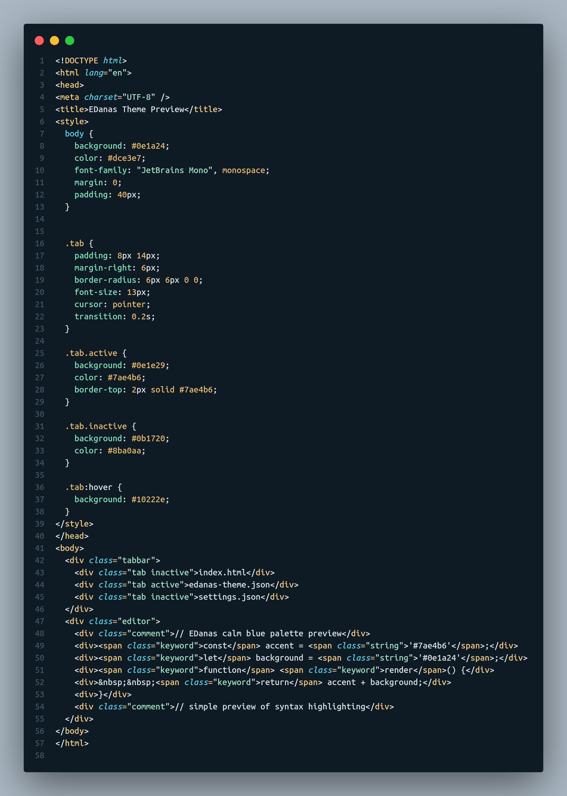
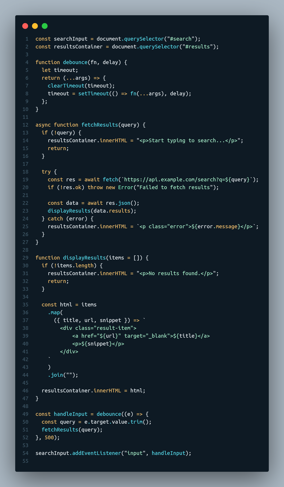

# 🌙 EDanas — Minimal Dark Theme for VS Code

**EDanas** is a calm, minimal dark theme for Visual Studio Code — blending subtle warm accents with balanced contrast for a focused and elegant coding experience.  
Designed for developers who value clarity, comfort, and timeless design.

  

---

## 🖼️ Preview

| HTML / CSS                       | JavaScript / JSX                     |
| -------------------------------- | ------------------------------------ |
|  |  |

_The screenshots above show EDanas in action — clean, balanced, and distraction-free._

---

## ✨ Features

- 🌑 **Minimal dark aesthetic** with subtle warm tones
- 🎨 Carefully tuned color contrasts for long coding sessions
- 🧠 Optimized for **JavaScript**, **JSX**, **HTML**, **CSS**, and more
- 💡 Consistent highlighting across multiple file types
- ⚙️ Easy to install, customize, and extend

---

## Installation

You can Download EDanas theme in 2 ways:

### **1️⃣ Manual Installation**

1.  Download the `edanas-vscode-theme` folder from the repository.
2.  Open VS Code.
3.  Open the **Command Palette** by pressing `Ctrl+Shift+P` (Windows/Linux) or `Cmd+Shift+P` (Mac).
4.  Type `Developer: Install from location...` and hit `Enter`.
5.  Navigate to and select the downloaded `edanas-vscode-theme` folder.
6.  You can now go to **Settings > Themes > Color Theme** and select **EDanas**.

### **2️⃣ Using VSIX Package**

1.  Download the `edanas-theme-*.*.*.vsix` file from the repository.
2.  Open VS Code.
3.  Open the **Command Palette** by pressing `Ctrl+Shift+P` (Windows/Linux) or `Cmd+Shift+P` (Mac).
4.  Type `Extensions: Install from VSIX...` and select it from the dropdown.
5.  A file explorer window will appear. Navigate to the location of your `edanas-theme-*.*.*.vsix` file, select it.
6.  VS Code will install the extension, and you'll receive a notification. You may need to restart VS Code for the changes to take full effect.
7.  You can now go to **Settings > Themes > Color Theme** and select **EDanas**.

---

## 🧩 Compatibility

EDanas provides consistent, refined highlighting across:

- HTML / CSS / SCSS
- JavaScript / JSX / TypeScript
- JSON / Markdown / YAML
- And more

All color values and token scopes are carefully adjusted to maintain visual harmony.

---

## ✅ Conclusion

Congratulations! 🎉

You have successfully installed the **EDanas VS Code Theme**.  
Enjoy a **minimal, dark, distraction-free coding environment** with subtle warm accents.

### Next Steps

- Explore your favorite programming files and see the theme in action.
- Customize the theme further by editing `edanas-color-theme.json` (optional).
- Share your experience and give credit if you use or distribute the theme.

> Tip: Keep the color palette minimal to maintain the calm, elegant vibe of EDanas.

---

## ❤️ Feedback & Contribution

If you enjoy the theme, consider:

- ⭐ **Starring the repository** to support its development
- 🐛 Opening an **issue** for feedback or color suggestions
